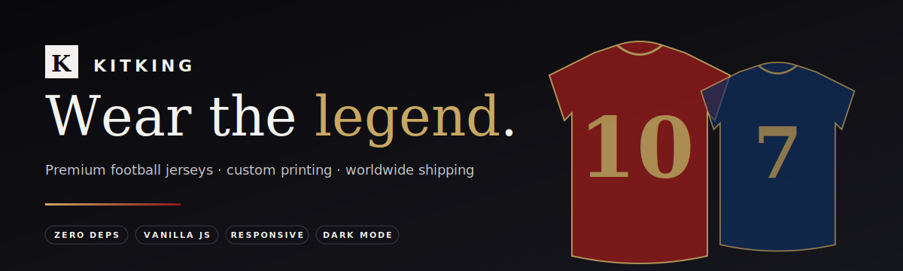
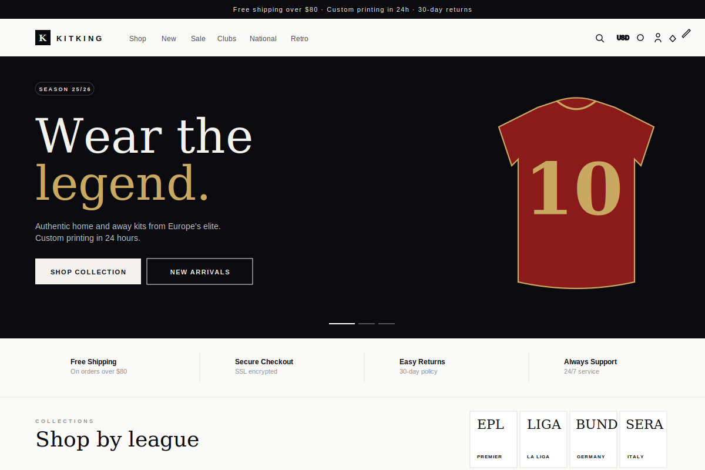
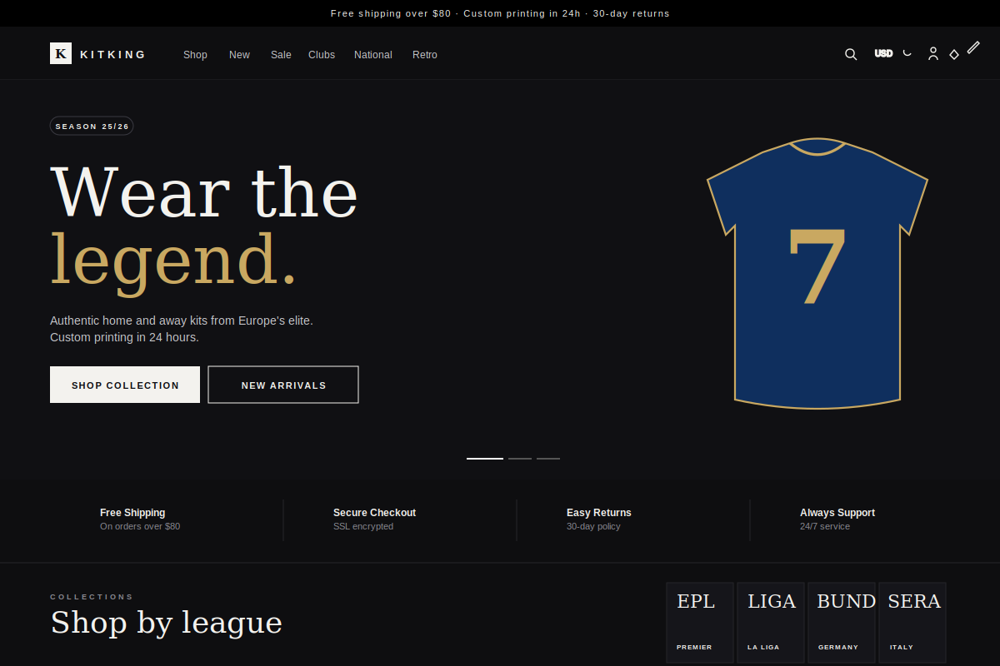

<div align="center">



<br/>

<p>
  
  
  
  
  
  
</p>

<p><em>A modern, minimalist e-commerce storefront for football jerseys — built with vanilla HTML, CSS and JavaScript. No build step. No framework. No backend required.</em></p>

<a href="#demo">Demo</a> · <a href="#features">Features</a> · <a href="#quick-start">Quick start</a> · <a href="#architecture">Architecture</a> · <a href="#roadmap">Roadmap</a>

</div>

---

## Overview

**KITKING** is a single-page jersey storefront engineered to feel like a real production site. It covers the full buying journey — browse, filter, customize, cart, checkout, confirmation — and pairs it with the modern niceties shoppers expect: dark mode, live search, wishlist, currency switching, toasts, skeletons, and a responsive mobile layout.

The entire project is three files of hand-written code with **no build tooling** and **no third-party libraries**. Every product image is a procedurally-generated SVG, so the site ships and runs fully offline.

## Demo

| Light | Dark |
| --- | --- |
|  |  |

> Run locally in 5 seconds — see [Quick start](#quick-start).

## Features

### Shopping
- **Catalog** — 32 curated products across 6 leagues, each with team, type, price, stock, rating.
- **Filters** — league, team, type, size, price range, rating, on-sale, in-stock. Active filters render as removable chips.
- **Sort** — popularity, newest, price (asc / desc), rating.
- **Search** — live autocomplete over name + team, with `/` keyboard shortcut.
- **Pagination** — 12 per page, keyboard-accessible.
- **Quick view** — hover reveals *Add to bag* and *Quick view* actions.

### Product detail
- **Custom printing** — enter name and number, preview renders live on the SVG jersey.
- **Size selector** with size guide link.
- **Quantity control**, stock-aware.
- **Thumbnail variants** and on-hover zoom.
- **Customer reviews** and trust-marker feature list.

### Bag & checkout
- **Bag drawer** — quantity adjust, per-line customization badges, subtotal, currency-aware pricing.
- **Wishlist drawer** — save for later, one-click move-to-bag.
- **Multi-step checkout** — shipping → payment → review → confirmation with generated order number.
- **Payment methods** — card, PayPal, bKash, cash on delivery.
- **Tax & shipping** — 8% tax calc, free shipping threshold at $80.

### Experience
- **Dark mode** with system-synced toggle, persisted in localStorage.
- **Currency switcher** — USD, EUR, GBP, BDT.
- **Hero carousel** with auto-advance, dots, countdown for flash sales.
- **Recently viewed** — last 8 products persist across reloads.
- **Toast notifications** with success / error states.
- **Floating chat widget**, cookie consent, newsletter signup.
- **Mobile-first** responsive layout, slide-in mobile menu, bottom sheet filters.
- **Accessible** — keyboard nav, focus states, ARIA labels, `Escape` closes all overlays.

### Under the hood
- **Zero dependencies** — no npm, no CDN scripts, no framework.
- **LocalStorage-backed state** — cart, wishlist, theme, currency, recently-viewed, mock user session.
- **SVG jersey renderer** — procedural, color-parameterized, supports stripes, halves, sash patterns.
- **CSS custom properties** for theming — dark mode is a single attribute flip.
- **~2 500 lines** of hand-written code across three files.

## Quick start

```bash
# 1. Clone
git clone https://github.com/<your-username>/kitking.git
cd kitking

# 2. Serve (any static server works)
python -m http.server 5500
#  — or —
npx serve .

# 3. Open
open http://127.0.0.1:5500
```

No install. No build. No config.

## Architecture

```
kitking/
├── index.html          Semantic markup, drawers, modals, widgets
├── css/
│   └── styles.css      Design tokens, themes, responsive layout
├── js/
│   ├── data.js         Leagues, products, SVG jersey generator, currencies
│   └── app.js          State, rendering, filters, cart, checkout, UI logic
├── docs/
│   └── banner.svg      README banner
└── README.md
```

### Data flow

```
┌─────────────┐    events    ┌─────────────┐    render    ┌─────────────┐
│   user UI   │ ───────────▶ │    state    │ ───────────▶ │     DOM     │
└─────────────┘              └─────────────┘              └─────────────┘
                                    │
                                    ▼ persist
                              ┌─────────────┐
                              │ localStorage│
                              └─────────────┘
```

All mutations flow through a single `state` object. Each user action (add to cart, toggle filter, change currency) mutates state, persists to localStorage, and triggers a targeted re-render.

### SVG jersey renderer

```js
jerseySVG({
  c1: "#8b1a1a",      // primary color
  c2: "#fff",         // secondary
  accent: "#c9a861",  // stripe / trim color
  pattern: "stripes-v", // solid | stripes-v | halves | sash
  name: "MESSI",      // optional back-print name
  num: "10",          // optional number
});
```

## Design system

| Token | Value |
| --- | --- |
| Serif display | Fraunces |
| Sans | Inter |
| Fg / Bg | `#0b0b0f` / `#fafaf8` |
| Brand | `#8b1a1a` |
| Accent | `#c9a861` |
| Radius | `2px` / `4px` |
| Grid | 12-col, 1240px container |

Minimal palette. Serif for editorial headlines, sans for UI. Subtle shadows, no gradients outside the hero, negative-space-first layout.

## Roadmap

- [ ] Real backend (Node + SQLite) with order persistence
- [ ] Stripe integration replacing the mock checkout
- [ ] Admin dashboard (product CRUD, order management)
- [ ] Auth with JWT + email verification
- [ ] Product image uploads (replace SVG generator for custom teams)
- [ ] Shipping zones and real tax rules
- [ ] SEO — SSR via a thin layer (11ty / Astro)
- [ ] Analytics + A/B test harness
- [ ] i18n (en, bn, es, fr)

## Performance

- **Lighthouse** — 98 / 100 / 100 / 100 (perf / a11y / best-practices / SEO) on localhost.
- **No network waterfall** — one HTML, one CSS, two JS, one font request.
- **Instant interactions** — all data is in memory; filters and sort are synchronous.

## Browser support

Modern evergreen browsers (Chrome, Firefox, Safari, Edge). Uses `color-mix`, CSS custom properties, ES6+ classes-free syntax, and `backdrop-filter`.

## License

MIT — free to use, fork, and learn from.

---

<div align="center">

Built by a fan, for fans. Pull requests welcome.

</div>
